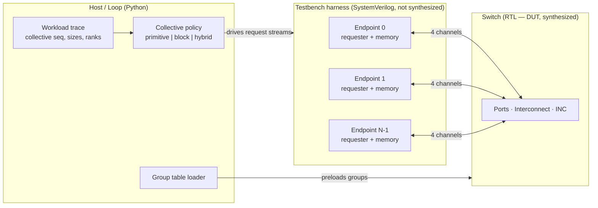
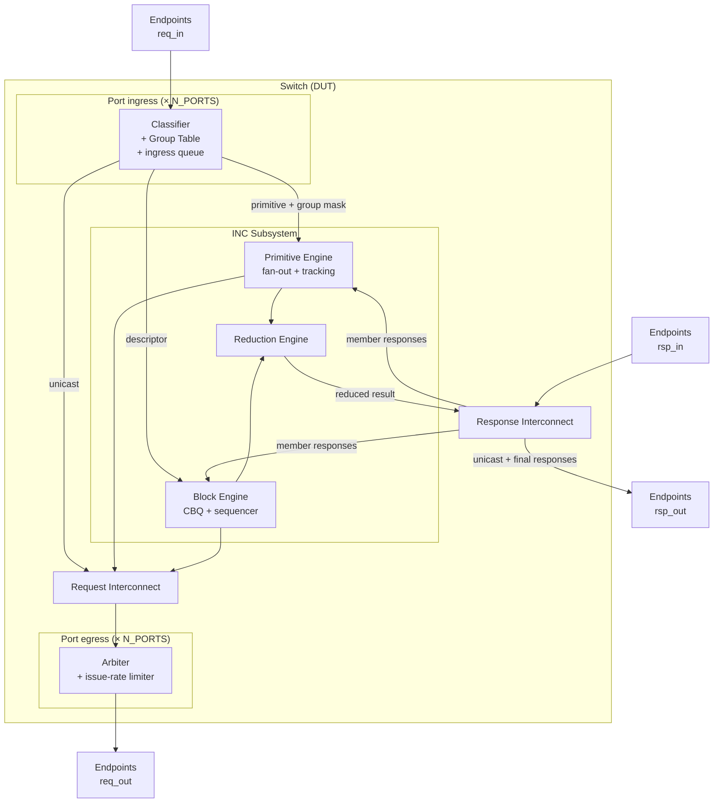
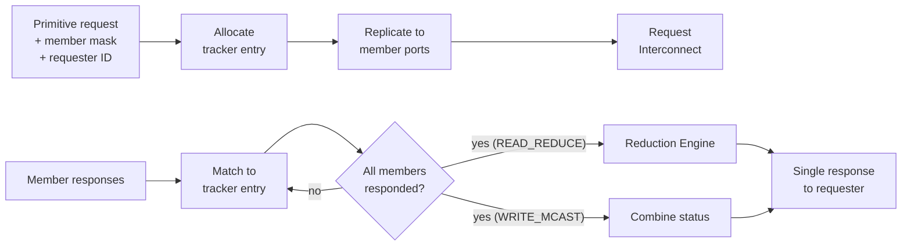
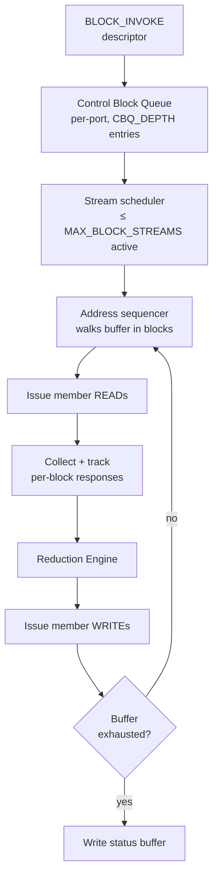
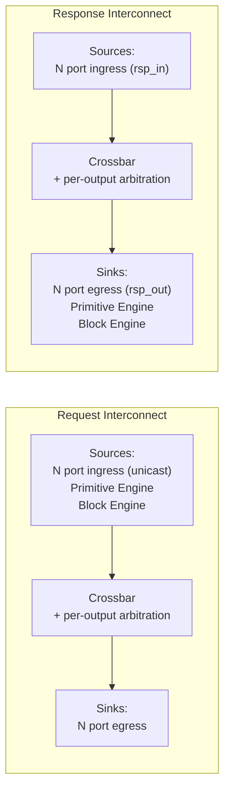

# Spec2INC Switch Architecture

Architecture specification for the UALink-inspired In-Network Compute (INC) switch model.
This document defines module boundaries, interfaces, transaction classes, and
parameterization. Microarchitecture (pipeline stages, state encodings, buffer sizing) is
deliberately out of scope and will follow in a separate document.

## 1. Purpose

The experiment this model exists to run: **at what point does offloading a collective as a
single block descriptor beat composing that same collective out of fine-grained collective
primitives?** Everything in the design is shaped by keeping that comparison honest, and
cutting anything that does not bear on it.

Both mechanisms are implemented in the same switch, over the same interconnect, against the
same endpoints, so that a sweep over endpoint count, message size, and collective type
isolates the mechanism as the independent variable.

## 2. Non-goals

This is not a UALink implementation and makes no claim of protocol compliance. The
following are explicitly abstracted away:

| Omitted | Rationale |
| --- | --- |
| Multi-switch topology, inter-switch routing | Target endpoint counts fit inside one switch's radix |
| RAS, retry, link-level error recovery | Orthogonal to the offload comparison |
| Security, virtual pod isolation, address masking | Orthogonal; adds table lookups without changing the tradeoff |
| Manageability, controller programming flows | Group tables are loaded directly by the testbench |
| Floating-point reduction, rounding modes, stochastic rounding | See §5.3 — one integer op keeps the datapath comparable |
| Independent tag spaces, response status lattices | Reduced to a single-bit OK/error status |
| ALL-GATHER, REDUCE-SCATTER as native operations | Not natively block-offloadable, so they cannot be compared symmetrically |

Where the design borrows a structural idea from UALink (per-port group tables, descriptor-driven
block offload, admission-controlled block concurrency), it does so because that structure is
load-bearing for the comparison, not to match the specification.

## 3. Terminology

| Term | Meaning |
| --- | --- |
| **Endpoint** | An accelerator attached to one switch port. Behavioral model, not RTL. |
| **Port** | One switch-side attachment point for an endpoint. Owns classification and a group table. |
| **Group** | A set of endpoints participating in a collective. Identified by a `GroupID`. |
| **Root** | The endpoint that initiates a collective and holds the distinguished buffer. |
| **Primitive** | A single fine-grained INC-targeted request that the switch replicates across a group. |
| **Block collective** | A whole collective expressed as one descriptor, executed autonomously by the switch. |
| **Requester** | The side of an endpoint that issues requests. |
| **Completer** | The side of an endpoint that services requests and returns responses. |

## 4. System architecture

The switch is the only synthesized module. Endpoints, workload traces, and the
primitive-vs-block selection policy live outside the DUT boundary.

### 4.1 DUT boundary

**Inside (synthesized, measured for area/Fmax/cycles):** port logic, group tables, request and
response interconnect, primitive engine, block engine, reduction engine.

**Outside (not synthesized):** endpoint requester/completer models, endpoint memory, workload
traces, GPU compute timing model, collective selection policy.

### 4.2 Endpoint model

Endpoints are **behavioral SystemVerilog** instantiated in the harness, not Python-per-beat and
not synthesized. The reasoning is simulation throughput: a block collective over 32 endpoints
generates thousands of switch-initiated beats, and routing every one through a Python callback
would dominate runtime across a CHIA sweep. Python drives the model at *collective* granularity
(issue this collective, with these parameters, at this time); the SystemVerilog endpoint handles
per-beat request servicing.

An endpoint model contains **no INC logic whatsoever**. It is:

- a **requester** that emits correctly formatted requests when told to, and
- a **completer** that services reads/writes against a memory array with a configurable
  response latency (`EP_RESP_LATENCY`).

An endpoint cannot distinguish a switch-initiated block read from an ordinary unicast read.
This is a deliberate invariant: it guarantees that any measured difference between the two
mechanisms originates in the switch, not in endpoint-side special-casing.

### 4.3 Port channels

Each port carries four independent channels:

| Channel | Direction | Carries |
| --- | --- | --- |
| `req_in` | Endpoint → Switch | Endpoint-initiated requests (unicast, primitive, block invoke) |
| `rsp_out` | Switch → Endpoint | Responses to endpoint-initiated requests |
| `req_out` | Switch → Endpoint | Switch-initiated requests (primitive fan-out, block reads/writes) |
| `rsp_in` | Endpoint → Switch | Responses to switch-initiated requests |

All four use ready/valid handshaking with beat-granular data on the request and response paths.

## 5. Transaction model

### 5.1 Endpoint-initiated requests

| Type | Target | Semantics |
| --- | --- | --- |
| `READ` | Unicast endpoint | Ordinary read. Switch forwards, returns data. |
| `WRITE` | Unicast endpoint | Ordinary write. Switch forwards, returns status. |
| `READ_REDUCE` | `GroupID` | Read the same address from every group member, reduce to one value, return it. |
| `WRITE_MCAST` | `GroupID` | Write the payload to every group member, return combined status. |
| `BLOCK_INVOKE` | Block queue | Deliver a descriptor that specifies an entire collective. Returns immediately. |

`READ_REDUCE` and `WRITE_MCAST` are the two collective primitives. `BLOCK_INVOKE` is the block
mechanism's sole entry point.

An INC-targeted request is structurally identical to a unicast one; only the destination field
encoding differs (a `GroupID` rather than an endpoint ID, or the block queue's reserved
address). Classification is entirely a switch-side concern — see §6.1.

### 5.2 Switch-initiated requests

The switch issues plain `READ` and `WRITE` requests to endpoints on `req_out`. These are
generated by the primitive engine (replicated fan-out) and the block engine (descriptor-driven
traffic). Endpoints service them identically to unicast traffic.

### 5.3 Reduction operation

A single operation: **integer/fixed-point add over `DATA_W`-bit lanes**, with lane width set by
`RED_LANE_W`. No floating point, no rounding modes, no datatype negotiation.

This is a scope cut, not an oversight. Reduction *arithmetic* cost is common-mode across both
mechanisms — both feed the same reduction engine — so datatype complexity would inflate the
design and its verification surface without moving the crossover point the experiment is
looking for. What does matter, and is preserved, is that reduction has **non-zero latency that
scales with group size** (§7.3).

## 6. Switch architecture

### 6.1 Port ingress

Each port independently classifies every arriving request into one of three paths:

1. **Unicast** → straight to the request interconnect, destination taken from the request.
2. **Collective primitive** → `GroupID` indexes this port's group table, producing a member
   bitmask; request plus mask plus requester ID go to the primitive engine.
3. **Block invoke** → descriptor goes to the block engine's control block queue.

**Group tables are per-port**, not global. Each port holds `GROUP_TABLE_ENTRIES` entries, each a
valid bit plus an `N_PORTS`-wide member bitmask. Per-port replication means classification never
contends across ports, which matches how a real switch scales lookup bandwidth with radix — and
it makes group table area scale with radix, which the synthesis numbers should reflect.

A request whose group is invalid, or whose requester is not a member, is dropped with an error
response. Groups with fewer than two members are rejected.

### 6.2 Port egress

Each port arbitrates among three request sources — unicast crossbar traffic, primitive fan-out,
and block engine traffic — and enforces `PORT_ISSUE_W` requests issued per cycle (default 1).

**This limiter is the single most important knob for result validity.** Without it, a block
collective would fan out to all N endpoints in one cycle, which no real switch permits, and the
block mechanism would win every sweep as an artifact of the model rather than a property of the
mechanism. Arbitration policy between the three sources is a microarchitecture decision, but the
existence of the limit is architectural.

## 7. INC subsystem architecture

### 7.1 Primitive engine

Handles one INC-targeted request at a time from the endpoint's perspective, but many
concurrently in flight.

The tracker holds up to `MAX_OUTSTANDING_PRIM` entries. Each records the requester, the expected
member set, responses received so far, and accumulated status. When the last member response
arrives, `READ_REDUCE` forwards the collected data to the reduction engine and `WRITE_MCAST`
returns combined status directly.

Tracker capacity is a genuine architectural limit: when it fills, the port ingress backpressures.
This is the primitive path's analogue of the block path's concurrency cap, and both must exist
for the comparison to be fair.

### 7.2 Block engine

A descriptor specifies: collective type, `GroupID`, input buffer offset, output buffer offset,
status buffer offset, and transfer length in blocks.

`BLOCK_INVOKE` returns a response to the requester **immediately on enqueue**, not on completion.
The requesting endpoint learns of completion by polling the status buffer the switch writes at
the end. This asynchrony is the block mechanism's central advantage and must be modeled
faithfully: it is precisely what frees the endpoint's requester from per-beat involvement.

Concurrency is capped at `MAX_BLOCK_STREAMS` actively draining collectives; further descriptors
wait in the control block queue, and a full queue backpressures. Per §6.2, this cap is what keeps
the block path from looking unrealistically good.

### 7.3 Reduction engine

An `N`-input adder tree, pipelined to `RED_LATENCY` stages, shared by both paths through an
arbiter.

Two properties are architecturally required:

1. **Latency scales with group size.** Reducing across more members costs more, so large groups
   are not free for either mechanism.
2. **It is a contended resource.** When primitive and block traffic are both active — the hybrid
   case the project ultimately wants to evaluate — they compete for it.

Whether the engine is genuinely shared or replicated per path (`RED_SHARED`) is left as a
parameter. This is itself a design-space question worth handing to the agent: sharing saves area
but couples the two mechanisms' throughput.

## 8. Interconnect architecture

Two independent networks, both full crossbars over `N_PORTS`.

A full crossbar is an appropriate model here rather than a convenient one: real switch silicon is
effectively non-blocking within its native radix, and every configuration under test
(`N_PORTS` ≤ 64) sits inside a single switch. The crossbar is also **common-mode** across the
comparison — both mechanisms traverse it — so its idealization shifts absolute cycle counts
without biasing which mechanism wins.

The realism that matters is not topological but **resource-related**, and lives in the arbiters
and issue limiters of §6.2, not in the crossbar's connectivity.

## 9. Collective realization

The heart of the experiment. The same three collectives, expressed two ways:

| Collective | Primitive path | Block path |
| --- | --- | --- |
| **BROADCAST** | Root issues a sequence of `WRITE_MCAST`, one per block of the buffer | One `BLOCK_INVOKE(BCAST)` |
| **REDUCE** | Root issues a sequence of `READ_REDUCE`, one per block | One `BLOCK_INVOKE(REDUCE)` |
| **ALL-REDUCE** | Sequence of `READ_REDUCE`, then sequence of `WRITE_MCAST` | One `BLOCK_INVOKE(ALLREDUCE)` |

The structural asymmetry this exposes:

- **Primitive:** cost scales with buffer size *at the requesting endpoint* — every block costs a
  request issue and a completion round trip. Fine-grained, composable, and the endpoint stays on
  the critical path throughout.
- **Block:** one descriptor regardless of buffer size, then the endpoint is uninvolved until it
  polls status. Coarse-grained, constrained by switch-internal concurrency, and inflexible about
  anything the descriptor cannot express.

The expected crossover: primitives win at small transfers where descriptor setup and status
polling dominate; block wins at large transfers where per-block endpoint issue overhead
dominates. Locating that boundary as a function of endpoint count, transfer size, and collective
type is the project's primary result.

## 10. Parameterization

| Parameter | Default | Sweep | Meaning |
| --- | --- | --- | --- |
| `N_PORTS` | 16 | 8 / 16 / 32 / 64 | Switch radix |
| `DATA_W` | 256 | fixed | Datapath width, bits per beat |
| `RED_LANE_W` | 32 | fixed | Reduction lane width |
| `PORT_ISSUE_W` | 1 | 1 / 2 | Requests issued per port per cycle |
| `MAX_OUTSTANDING_PRIM` | 32 | 8 / 32 / 128 | Primitive tracker entries |
| `MAX_BLOCK_STREAMS` | 4 | 1 / 4 / 16 | Concurrently draining block collectives |
| `CBQ_DEPTH` | 16 | fixed | Control block queue entries per port |
| `RED_LATENCY` | 3 | 1 / 3 / 6 | Reduction pipeline stages |
| `RED_SHARED` | 1 | 0 / 1 | Share reduction engine across paths |
| `GROUP_TABLE_ENTRIES` | 64 | fixed | Groups per port |
| `EP_RESP_LATENCY` | 20 | 10 / 20 / 80 | Endpoint memory response latency (harness, not DUT) |

The resource parameters are not just tuning — sweeping them answers a second question worth
reporting: **how sensitive is the primitive-vs-block crossover to how generous the switch's
internal resources are?** A crossover that moves sharply with `MAX_BLOCK_STREAMS` is a
substantially different finding from one that does not.

## 11. Instrumentation

Collected per run, at collective granularity:

| Metric | Source | Purpose |
| --- | --- | --- |
| Completion cycles | RTL counter, invoke → final status | Primary comparison metric |
| Endpoint issue count | Endpoint model | Quantifies per-block requester overhead |
| Endpoint requester occupancy | Endpoint model | Compute/communication overlap headroom |
| Port utilization | Per-port RTL counters | Interconnect pressure |
| Reduction engine occupancy | RTL counter | Contention, especially in hybrid mode |
| Requests / bytes on wire | Per-port RTL counters | Efficiency per unit of data moved |
| Stall cycles by cause | RTL counters | Attributes cost to tracker full / CBQ full / issue limit |
| Area, Fmax | Synthesis | **Deferred** — see below |

Stall attribution matters more than it might appear: a crossover explained by "block engine
starved on concurrency cap" is a different result from "endpoint saturated on issue rate," and
only per-cause counters distinguish them.

**Area and Fmax are deferred.** The primary result is a cycles-and-overhead question, so a PDK
flow is not on the critical path and will be added retroactively if the performance results
warrant it. To keep that option cheap, the DUT is held to a synthesizable subset from the start
and checked with a PDK-less Yosys elaboration pass (`read_verilog` + `synth -top` + `stat`),
which also yields a generic cell count as a crude area proxy. The failure mode this guards
against is discovering late that the DUT was never synthesizable — Verilator will simulate
constructs Yosys rejects.

## 12. Verification

The cocotb reference model is built independently of the RTL and stays outside the DUT, so the
design agent can modify the switch without touching its own checker. It:

1. Computes expected buffer contents for each collective from the endpoint memory images.
2. Checks final memory state after every collective, both mechanisms.
3. Asserts **mechanism equivalence** — primitive and block paths must produce bit-identical
   results for the same collective and inputs.

Point 3 is the strongest available check: it is what makes any measured performance difference
attributable to mechanism cost rather than to the two paths quietly computing different things.

## 13. Open architecture questions

Deferred, and reasonable candidates for the agent to explore:

1. **Egress arbitration policy** — how port egress prioritizes unicast vs. primitive vs. block
   traffic. Starving unicast under a large block collective is a real risk.
2. **Reduction sharing** (`RED_SHARED`) — area saving vs. throughput coupling.
3. **Block sequencer read/write overlap** — whether a block collective may issue reads for
   block *k+1* before writes for block *k* retire.
4. **Group table sizing** — per-port replication cost at radix 64.
5. **Hybrid policy surface** — what the software layer is allowed to vary when selecting between
   mechanisms per collective, which is the project's agent-optimized design point.
